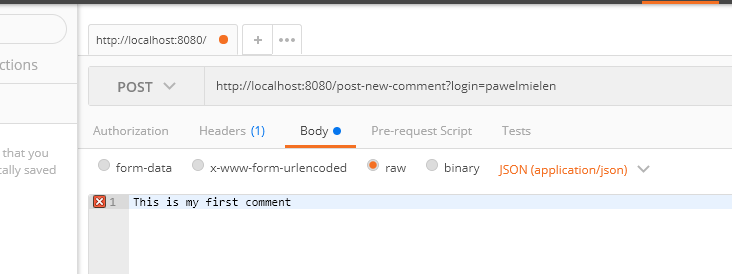

# Getting Started

### Pre-requisits
* Any type of REST client, For example: [Postman](https://www.postman.com/downloads/)  
* Maven 3.6.0 (version with which software was built)
### Posting
By default we can post new comments (and register new user) by executing following POST request 
http://localhost:8080/post-new-comment?login={login} 
with body of request containing simple comment message, we should use JSON(application/json) found under option raw  
For example: 

  
### Wall 
By default we can post view our comments by executing following GET request 
http://localhost:8080/get-own-comments?login={login}  
For example: 
http://localhost:8080/get-own-comments?login=pawelmielen  
### Following 
By default we can start following other users by executing following POST request 
http://localhost:8080/follow/{follower}/{toFollow}  
For example: 
http://localhost:8080/follow?followingLogin=pawelmielen&followedLogin=jankowalski  
### Timeline 
By default we can view posts of users we follow by executing following GET request 
http://localhost:8080/get-followed-comments?login={login}  
For example: 
http://localhost:8080/get-followed-comments?login=pawelmielen  
### Building 
Since this application is created with help of Maven build command is 
<b>mvn clean install</b>  
### Running 
To run our application we need to execute following Maven command 
<b>mvn spring-boot:run</b>  

